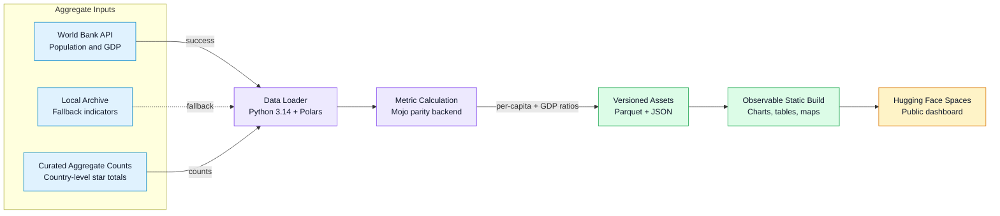
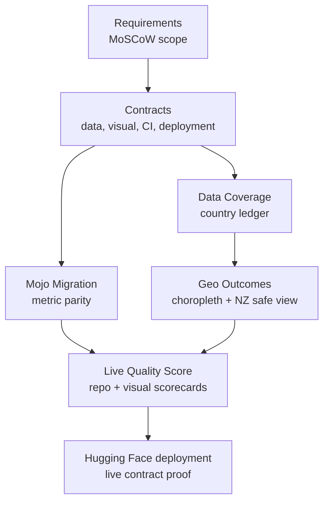
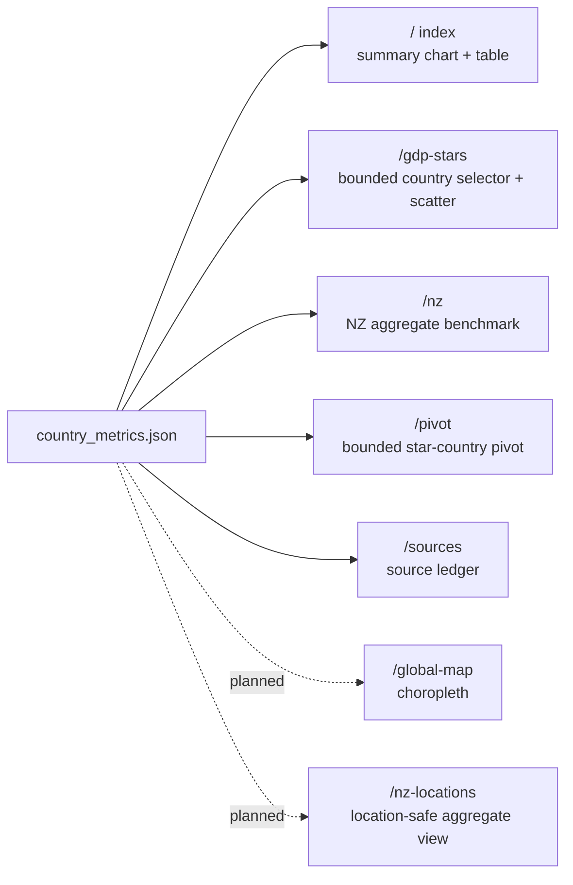

# Design

This document records the Conductor design model for the dashboard and its planned extensions.

## System Data Flow

## Track Dependency Design

## Visualisation Design

## Design Rules

- Public pages must communicate aggregate analysis first, not marketing copy.
- Controls must be bounded enough to remain inspectable on desktop and mobile.
- Charts must render nonblank SVG marks or provide explicit empty states.
- Geographic views must distinguish supported, missing, withheld, and unverified data.
- Exact public point data for New Zealand is blocked unless source and redistribution rights are
  documented first.
