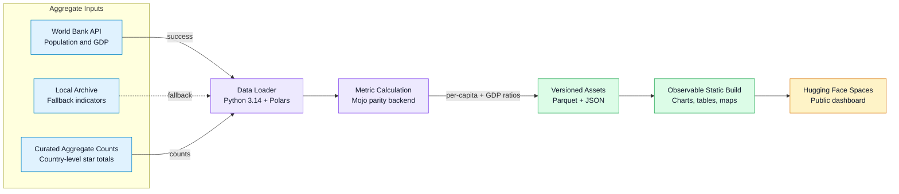

# Aggregate Gastronomy Indicator Dashboard Specification

This document defines the current aggregate-only requirements for the dashboard. The canonical
MoSCoW register is [requirements.md](./requirements.md); this specification keeps the core
product scope and architecture summary close to the original Conductor setup.

## Requirements

### Must Have

* Country-level analysis of aggregate star counts against population and GDP.
* Build-time data preparation that emits compact Parquet assets for Observable Framework.
* Client-side charts and pivot controls over aggregate country metrics only.
* Clear source, license, and methodology notes for every redistributed metric.
* Explicit exclusion of restricted third-party source rows and submitted review content.
* Verified authorship and ORCID connection (`0000-0002-5364-1650`) for Dylan A. Mordaunt.

### Should Have

* Ruff, Pytest, property tests, basedpyright, npm lint, and static smoke checks in CI.
* Fail-closed data handling when upstream demographic APIs fail.
* Deterministic build artifacts for Hugging Face Spaces deployment.
* Repository documentation that keeps legal/data-scope limitations visible.

### Could Have

* A future Zenodo release after manual record review and DOI minting.
* Additional aggregate public indicators where redistribution rights are documented.
* More pivot dimensions if they remain aggregate and license-compatible.

### Won't Have

* Public individual restaurant records.
* Public review ingestion or review-derived analysis.
* Public guide text, coordinates, booking metadata, photos, or scraped source rows.

## Architecture And Data Flow

