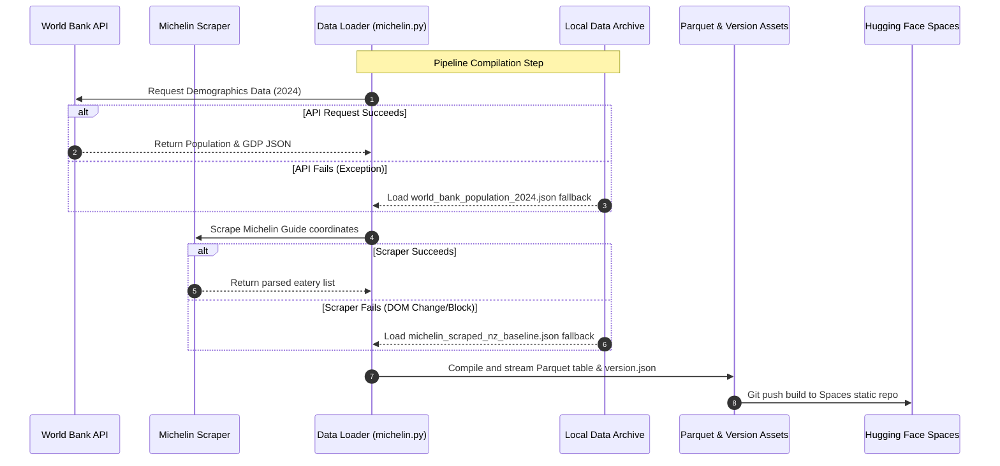

# Gastronomy Data Science Dashboard System Specification

This document defines the MoSCoW requirements and architectural blueprints for the **open-source gastronomy data science** dashboard repository.

---

## 📋 MoSCoW Requirements

### 1. Must Have (Essential Core)
*   **Dual-Dataset Benchmarking:** Direct correlation analysis between country Michelin Star allocations, GDP, and Population.
*   **In-Browser Analysis:** Client-side SQL execution over `.parquet` tables using DuckDB WASM.
*   **Interactive Maps:** GPU-accelerated coordinate mapping via Deck.gl and node-link influence networks via Cosmograph.
*   **Archival Fallback Data:** Local cached JSON records to guarantee compilation if external APIs or scrapers fail.
*   **Verified Authorship:** Explicit attribution and ORCID connection (`0000-0002-5364-1650`) for Dylan A. Mordaunt.

### 2. Should Have (Code Quality & Packaging)
*   **Strict Code Linting:** Ruff checking for Python (100-character line limits) and ESLint/Prettier for JavaScript.
*   **High Test Coverage:** >90% unit test coverage using Pytest and Hypothesis property-based testing.
*   **Automated Dependency Management:** Renovate configuration for security upgrades.
*   **Dynamic Data Versioning:** SHA256-based data-compilation tags mapped on the build output.

### 3. Could Have (Publishing & Integrations)
*   **Zenodo Webhook Release:** Webhook hooks using `.zenodo.json` to mint DOIs on new Git tags.
*   **Hugging Face Spaces Deployment:** Daily scheduled builds pushing compiled static outputs directly to Hugging Face.

### 4. Won't Have (Deferred)
*   **Dynamic CMS Editing UI:** Inline direct review edits (contributions remain PR-driven).

---

## 🎨 System Architecture & Data Flow

